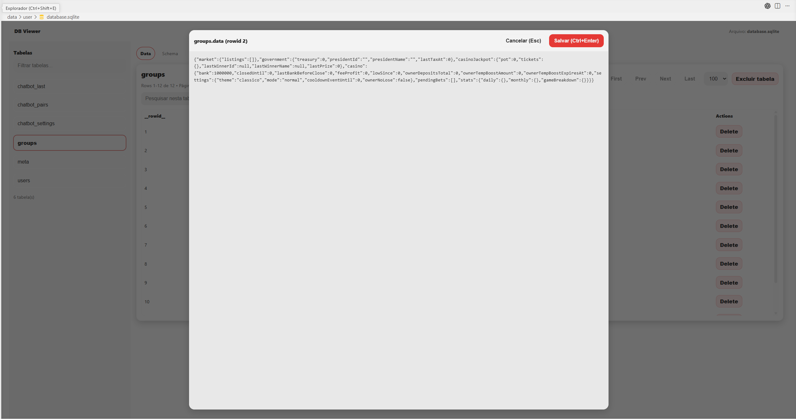
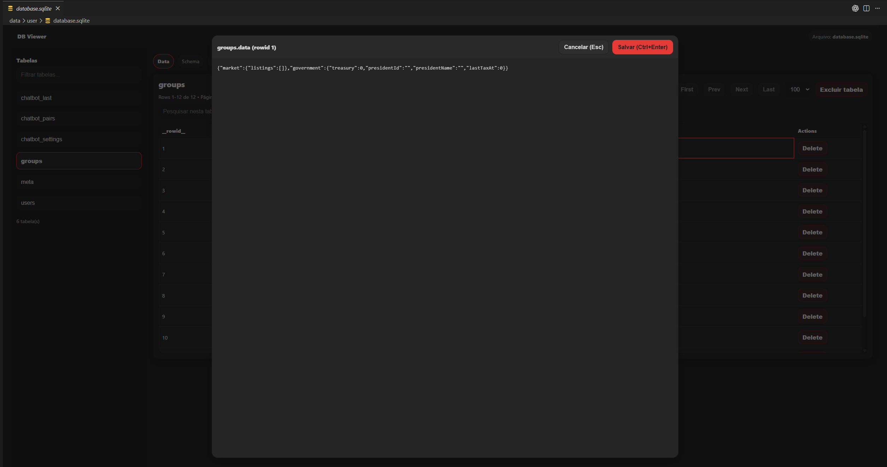

# 🚀 SQL Engine

**SQL Engine** é uma extensão para **Visual Studio Code** criada para facilitar a visualização e o gerenciamento de bancos de dados SQL diretamente no editor.

Com uma interface simples e recursos práticos, a extensão permite explorar esquemas, executar consultas SQL e visualizar resultados sem depender de ferramentas externas.

---

## ✨ Funcionalidades

- **Explorador de Banco de Dados**  
  Navegue por arquivos SQLite e visualize tabelas, colunas e estruturas.

- **Execução de Queries**  
  Execute comandos SQL diretamente no VS Code e veja os resultados em tempo real.

- **Visualização de Dados**  
  Consulte registros de forma organizada dentro da interface da extensão.

- **Edição de Células**  
  Edite valores diretamente no visualizador de tabelas.

- **Suporte Expansível**  
  Atualmente focado em **SQLite**, com estrutura preparada para expansão para outros SGBDs.

---

## 📸 Demonstração

### Visualização de colunas



### Visualização de dados



---

## 🛠️ Tecnologias Utilizadas

- **TypeScript**
- **VS Code Extension API**
- **Node.js**
- **sql.js**

---

## 🚀 Como Começar

### Instalação

1. Abra o **Visual Studio Code**
2. Vá até a aba de **Extensões** (`Ctrl + Shift + X`)
3. Pesquise por **SQL Engine**
4. Clique em **Instalar**

### Uso Básico

1. Abra um arquivo com uma das extensões abaixo:
   - `.sqlite`
   - `.db`
   - `.sqlite3`
2. A extensão será ativada automaticamente
3. Utilize os comandos disponíveis para explorar tabelas e executar consultas

---

## ⌨️ Comandos

| Comando | Descrição |
|---------|-----------|
| `dbViewer.openSqlite` | Abre um arquivo SQLite para visualização |
| `dbViewer.refreshExplorer` | Atualiza o explorador de banco de dados |
| `dbViewer.showTable` | Exibe uma tabela específica |
| `dbViewer.runQuery` | Executa uma consulta SQL personalizada |

---
## 📄 Licença

Defina aqui a licença do projeto. Exemplo:

```text
MIT License
```

---

## 👨‍💻 Autor

Desenvolvido por **[sr4kkk](https://github.com/sr4kkk)**.
